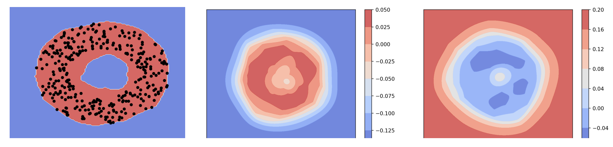

<!--
Copyright (C) 2019-2023 Mitsubishi Electric Research Laboratories (MERL)

SPDX-License-Identifier: AGPL-3.0-or-later
-->
# Generalized one-class learning using pairs of complementary classifiers



## Overview
This repository contains training and testing code reported in the ICCV 2019 paper titled "GODS: Generalized One-class Discriminative Subspaces for Anomaly Detection" by Jue Wang and Anoop Cherian and TPAMI 2022 paper titled "Generalized One-Class Learning Using Pairs of Complementary Classifiers" by Anoop Cherian and Jue Wang. We provide a PyTorch implementation of GODS and the Kernelized GODS (KGODS) algorithms for anomaly detection using a pair of complimentary classifiers. Our key idea in these approaches is to learn a pair of complementary classifiers to flexibly bound the one-class data distribution, where the data belongs to the positive half-space of one of the classifiers in the complementary pair and to the negative half-space of the other. The provided code implements the anomaly detection using bag-of-words features of human pose skeletons; however in the papers, we show several experiments in which the approaches are applied on deep learned features, and other hand-crafted representations.

## Setup
Please see `requirements.txt` for the dependencies.

***Important Note:*** To use the KGODS implementation, you will need pymanopt-0.2.4. After installing PyManOpt, please copy the files in `pymanopt-patch` to `$PYMANOPT_ROOT/pymanopt/manifolds`, where `$PYMANOPT_ROOT` is the folder where PyManOpt is installed. This is important since we have our own implementation of the ***Generalized Stiefel manifold*** that is not available in PyManOpt and is needed when using the kernelzied GODS algorithm.

## How to run the code?
1. First, run the following command to create the preprocessed data

```
$python bow_embed_pose.py --poses_root ../multiclass/tmp/ --embed_path ./data/embed \
    --gt ./data/gt/Video_List1.txt --split_num 1
```

2. Run the following command for training the kgods model (on splits 2,3,4) and testing on split 1.

```
$python kgods.py --embed_path ./data/embed/ --split_num 1 --eta 0.0001 \
    --num_subspaces 1 --sigma 0.01
```

3. Run the following command for training and testing using the improved gods model.

```
$python kgods.py --embed_path ./data/embed/ --split_num 1 --eta 0.01 \
    --max_iter 1000 --num_subspaces 5 --L 0.1 --unnormalize
```

4. To use gods.py, the command line is similar:

```
$python gods.py --embed_path ./data/embed/ --split_num 1 --eta 0.01 \
    --max_iter 1000 --num_subspaces 5 --L 0.1 --unnormalize
```

You should get the following outputs, if everything goes well.

***Directory Structure:***

./multclass/tmp has preprocessed pose data extracted using openpose

./data/gt: has train/val splits

./data/embed: is where bow embedded data (from bow_embed_pose.py) is stored.

Other python dependencies are provided in python_dependencies.txt

For questions, please email: cherian@merl.com


# Citations
Please cite the following papers, if you use this code:

```
@inproceedings{wang2019gods,
title={Gods: Generalized one-class discriminative subspaces for anomaly detection},
author={Wang, Jue and Cherian, Anoop},
booktitle={Proceedings of the IEEE/CVF International Conference on Computer Vision},
pages={8201--8211},
year={2019}
}

@article{cherian2021generalized,
title={Generalized one-class learning using pairs of complementary classifiers},
author={Cherian, Anoop and Wang, Jue},
journal={IEEE Transactions on Pattern Analysis and Machine Intelligence},
volume={44},
number={10},
pages={6993--7009},
year={2021},
publisher={IEEE}
}
```

# License

Released under `AGPL-3.0-or-later` license, as found in the [LICENSE.md](LICENSE.md) file.

All files, except as listed below:

```
Copyright (c) 2019-2023 Mitsubishi Electric Research Laboratories (MERL).

SPDX-License-Identifier: AGPL-3.0-or-later
```

`pymanopt-patch/generalizedstiefel.py` and `pymanopt-patch/__init__.py` were adapted from pymanopt-0.2.4.
For license details, see [LICENSES/BSD-3-Clause.md](LICENSES/BSD-3-Clause.md).

```
Copyright (c) 2019-2023 Mitsubishi Electric Research Laboratories (MERL)
Copyright (c) 2015-2016, Pymanopt Developers.

SPDX-License-Identifier: AGPL-3.0-or-later
SPDX-License-Identifier: BSD-3-Clause
```
